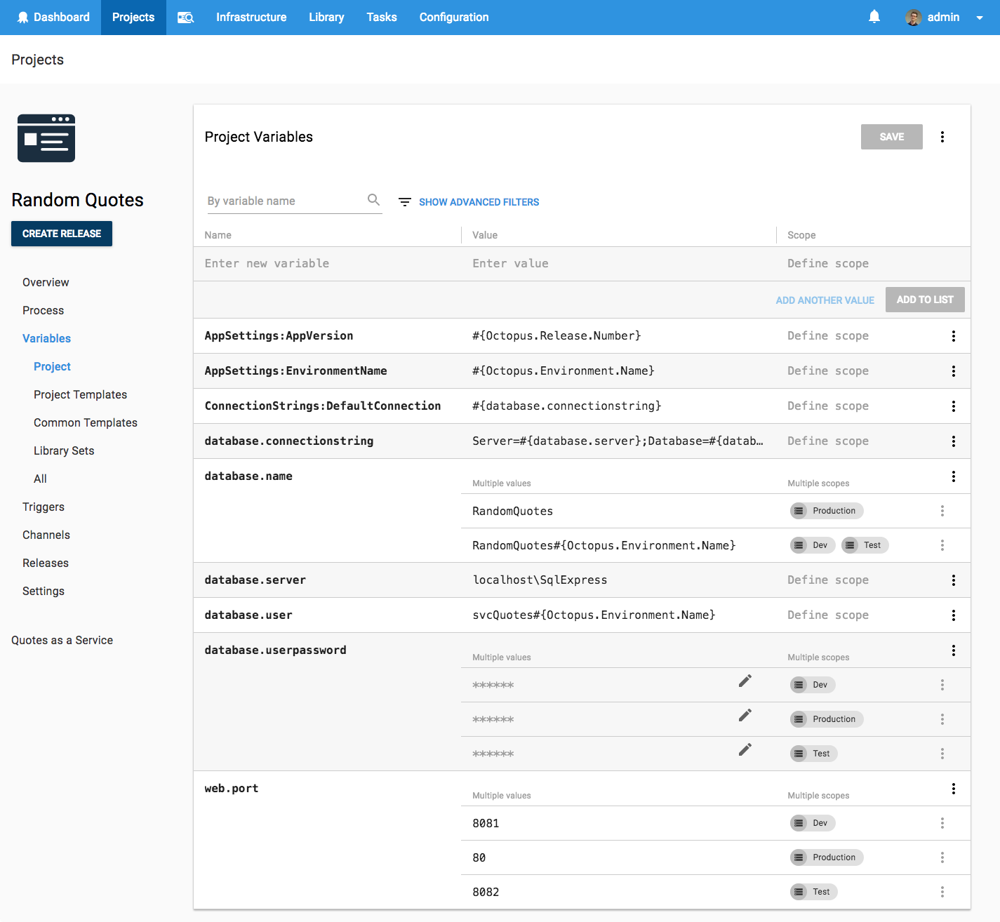

# Deploying to SQL Server with Entity Framework Core - Will it Deploy? Episode 3

Will it deploy is a video series where we try to automate the deployment of different technologies with Octopus Deploy. Episode 3 is a good one where we try to deploy a Microsoft SQL Server database using Entity Framework Core migrations to an Amazon Web Services (AWS) virtual machine (VM).

## Problem

### Tech Stack

Our app is a quote generator called Random Quotes. The application is quite simple but it allows us to illustrate how to deploy database changes and updates.

* Microsoft [ASP.NET Core 2.0](https://docs.microsoft.com/en-us/aspnet/core/) web app
* [Entity Framework Core 2.0](https://docs.microsoft.com/en-us/ef/core/) framework
* Microsoft [SQL Server 2017](https://www.microsoft.com/en-au/sql-server/) database

Kudos to our marketing manager [Andrew](https://twitter.com/andrewmaherbne) who has been learning to code and built the first cut of this app. Great work! 

### Deployment Target

* AWS - [EC2](https://aws.amazon.com/ec2) virtual machine 
* Microsoft [Windows Server 2016](https://www.microsoft.com/en-au/cloud-platform/windows-server)

## Solution

So will it deploy? **Yes it will!** Our deployment process looks like the following.

Then we add the following steps to successfully deploy our database changes and web app.

- Octopus **Deploy a Package** step to copy our database scripts to our database deployment target
- Octopus Community Contributed step template -  **[SQL - Execute Script File](https://library.octopusdeploy.com/step-template/actiontemplate-sql-execute-script-file)** to execute our Entity Framework Core migration script agaist our SQL Server database. 
- Octopus **Deploy to IIS** step to deploy our ASP.NET Core web application

This project uses the following variables to store our app settings, database connection details and web app configuration.

